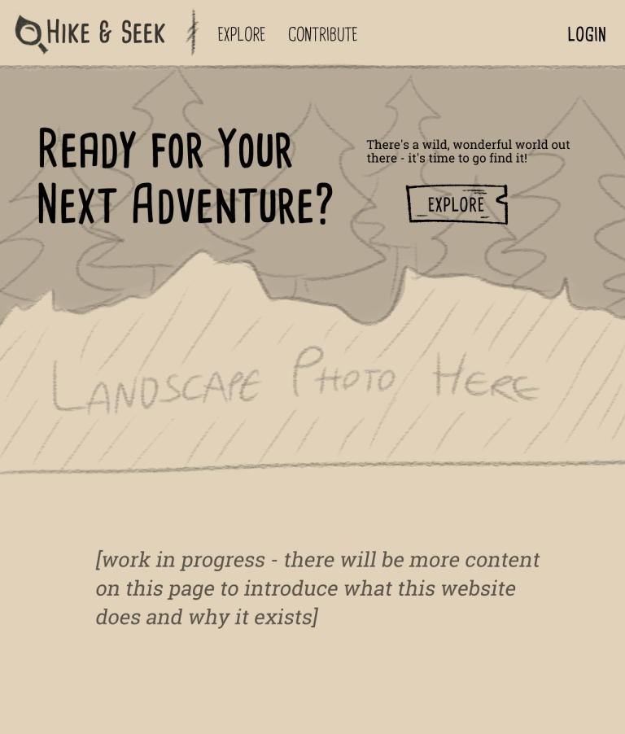

# Project Title

Hike & Seek

(Alt: "Wanderwild", but I like the playfulness of Hike & Seek)

## Overview

Hike & Seek aims to encourage local exploration and responsible hiking, and foster an appreciation for users' local ecosystems by helping users find places for outdoor recreation and educating users about the wildlife they may find there.

### Problem Space

Many individuals, particularly those in urban areas, experience a disconnect from natural spaces and a lack of knowledge about local ecosystems. This gap in understanding diminishes outdoor experiences and makes it hard to find those outdoor experiences to begin with. Unless you already know a good spot to hike or camp, it can be a struggle to find a place to go - and many small local hiking trails and campgrounds don't have an online presence, which makes them nigh-impossible for a beginner to find. Additionally, without knowledge of the kinds of wildlife they may encounter, an aspiring outdoorman misses valuable educational opportunities, and may even inadvertently harm wildlife or their habitats.

### User Profile

- Outdoor enthusiasts:
	- ...looking for a new spot to hike, camp, or unwind in nature close to their location
	- ...looking for spots to hike or camp close to a given location for the future
	- ...that want to keep track of trails, campgrounds, and parks they want to visit
	- with a focus on beginners to these activities, though individuals of all experience levels are welcome.

### Features

List the functionality that your app will include. These can be written as user stories or descriptions with related details. Do not describe _how_ these features are implemented, only _what_ needs to be implemented.

- As a user, I want to be able to find trails and campgrounds close to my current location.
- As a user, I want to be able to find trails and campgrounds close to any given location.
- As a user, I want to learn about wildlife I can encounter at a given trail or campground.
- As a user, I want to filter what iconic taxa (broad, well-known groups of wildlife) are displayed for each location.
- As a user, I want to be able to save or print a sightings checklist of wildlife from a location

- As a user, I want to be able to create an account to manage natural spaces I want to visit.
- As a user, I want to be able to login to my account to manage natural spaces I want to visit.

- As a logged in user, I want to be able to see wildlife available at my saved locations.
- As a logged in user, I want to be able to filter what iconic taxa are displayed for my saved locations.

## Implementation

### Tech Stack

List technologies that will be used in your app, including any libraries to save time or provide more functionality. Be sure to research any potential limitations.

- React
- Express
- Client libraries:
	- react
	- react-router
	- react-leaflet
	- axios
- Server libraries:
	- express
	- knex
	- axios
	- bcrypt for password hashing

### APIs

- [OSM's Overpass API](https://wiki.openstreetmap.org/wiki/Overpass_API)
- [iNaturalist API](https://api.inaturalist.org/v1/docs/)

### Sitemap

List the pages of your app with brief descriptions. You can show this visually, or write it out.

- Home page
	- Introduce website purpose, Call to action (go to find trails page)
- Find new trails page
	- Form which lets user enter a location and details on the kind of place they're searching for; displays results on a map.
- View & save a trail
	- View more details about a trail/campground/other point of interest
- View an organism
	- View more details about a given species
- Save/print a sightings checklist
	- From a trail/point of interest, get a printable checklist of species you may see there.
- Contribute
	- Brief information about data sources (iNaturalist, OSM) and call to action to contribute to those projects
- Register
- Login

### Mockups

Provide visuals of your app's screens. You can use pictures of hand-drawn sketches, or wireframing tools like Figma.

#### Home page
*TODO*


#### Find new trails page
*TODO*


#### View & save a trail
*TODO*


#### View an organism
*TODO*


#### Save/print a sightings checklist
*TODO*


#### Contribute
*TODO*


#### Register
*TODO*


#### Login
*TODO*


### Data

Describe your data and the relationships between the data points. You can show this visually using diagrams, or write it out.

*TODO*


### Endpoints

#### **GET /pois**

- Get *Points of Interest* - trails, campgrounds, natural parks, etc - close to a certain location. Data pulled from OSM's Overpass API.

Parameters:
- longitude: User-provided location as a number
- latitude: User-provided location as a number
- radius: User-provided distance as a number

Response:
```
[

]
```

#### **GET /pois/:id**

- Get available metadata for a specific Point of Interest. Data pulled from OSM's Overpass API.

Parameters:
- id: PoI identifier as a number

Response:
```
[

]
```

#### **POST /pois/:id**

- Logged in user can save a Point of Interest to their personal list.

Parameters:
- id: PoI identifier as a number
- token: JWT used to identify the user saving the location.

Response:
```
[

]
```

#### **DELETE /pois/:id**

- Logged in users can remove a Point of Interest from their personal list.

Parameters:
- id: PoI id as a number
- token: JWT used to identify the user removing the location.

Response:
```
[

]
```

#### **GET /life**

- Get a list of species that have previously been sighted within a radius of a certain location, within the current month of the year. Data pulled from iNaturalist.

Parameters:
- longitude: Location as a number
- latitude: Location as a number
- taxa: User-provided comma-separated list of iconic taxa to include in the results

Response:
```
[

]
```

#### **GET /life/:id**

- Get more information about a specific species. Data pulled from iNaturalist.

Parameters:
- id: Species identifier as a number.

Response:
```
[

]
```

#### **POST /users/register**

- Add a user account.

Parameters:
- email: User's email
- password: User's provided password

Response:
```
{
	"token": "..."
}
```

#### **POST /users/login**

- Log a user in.

Parameters:
- email: User's email
- password: User's provided password

Response:
```
{
	"token": "..."
}
```

### Auth

- JWT auth
	- Before adding auth functionality, relevant API requests will be made using a fake user with id 1.
	- Auth functionality will be added after core features have been implemented.
	- If user asks the site to remember them on login, JWT will be saved in localStorage; if not, it will be saved to sessionStorage; in either case, it is removed upon logout.
	- Add states for logged in that show different UI in relevant areas.

## Roadmap

*TODO* more detailed breakdown of features

- Create client - Day 1
	- react project with routes, boilerplate pages, other preliminary set up

- Create server - Day 1
	- express project with routing, with placeholder 501 responses

- Create database migrations - Day 1
- Create seeds for fake user data - Day 1

- Deploy client and server projects so all commits will be reflected in production - Day 1

- Feature: Find Trails Page - Day 2

- Feature: View Trail Page - Day 3

- Feature: Sighting Checklist Page - Day 4

- Feature: Home Page - Day 5

- Feature: Contribute Page - Day 5

- Feature: View Organism Page - Day 6

- Feature: Manage Saved Trails Page - Day 7

- Feature: Create account - Day 8

- Feature: Login - Day 8

- Feature: Implement JWT tokens - Day 9

- Bug fixes

- DEMO DAY

---

## Future Implementations
Your project will be marked based on what you committed to in the above document. Here, you can list any additional features you may complete after the MVP of your application is built, or if you have extra time before the Capstone due date.

- User authentication may be a future implementation, depending on time.
- Forgot password & password change functionality.
- Get directions from a specified location to a given point of interest.
- Unit and Integration tests.