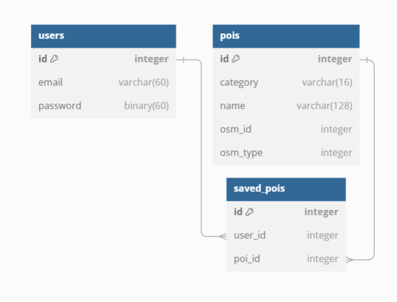

# 🍃🔍 Hike & Seek

## Overview

Hike & Seek aims to encourage local exploration and responsible hiking, and foster an appreciation for users' local ecosystems by helping users find places for outdoor recreation and educating users about the wildlife they may find there.

## Installation

1. Install [PostgreSQL](https://www.postgresql.org/download/)
2. Create a new postgres database to store Hike & Seek's data
2. Install [Nodejs](https://nodejs.org/en)
3. Clone this repository and [the repository for the API](https://github.com/egarand/bstn-capstone-api)
4. For the front end repository (you are here):
    1. Copy `.env.sample`, rename it to `.env`, and make sure each variable is set how you need it. `VITE_API_URL` will need to match the port you set for the API.
    2. `npm install`
    3. `npm run dev`
5. For the API repository:
    1. Copy `.env.sample`, rename it to `.env`, and make sure each variable is set how you need it. Make sure the ones prefixed `DB_` match your local database set up.
    2. `npm install`
    3. `npm run db:migrate`
    4. `npm run db:seed`
    5. `npm run dev`

### Problem Space

Many individuals, particularly those in urban areas, experience a disconnect from natural spaces and a lack of knowledge about local ecosystems. This gap in understanding diminishes outdoor experiences and makes it hard to find those outdoor experiences to begin with. Unless you already know a good spot to hike or camp, it can be a struggle to find a place to go - and many small local hiking trails and campgrounds don't have an online presence, which makes them nigh-impossible for a beginner to find. Additionally, without knowledge of the kinds of wildlife they may encounter, an aspiring outdoorman misses valuable educational opportunities, and may even inadvertently harm wildlife or their habitats.

### User Profile

- Outdoor enthusiasts:
  - ...looking for a new spot to hike, camp, or unwind in nature close to their location
  - ...looking for spots to hike or camp close to a given location for the future
  - ...that want to keep track of trails, campgrounds, and nature reserves they want to visit
  - with a focus on beginners to these activities, though individuals of all experience levels are welcome.

### Features

- As a user, I want to be able to find trails and campgrounds close to my current location.
- As a user, I want to be able to find trails and campgrounds close to any given location.
- As a user, I want to learn about wildlife I can encounter at a given trail or campground.
- As a user, I want to filter what iconic taxa (broad, well-known groups of wildlife) are displayed for each location.

- As a user, I want to be able to create an account to manage natural spaces I want to visit.
- As a user, I want to be able to login to my account to manage natural spaces I want to visit.

- As a logged in user, I want to be able to see wildlife available at my saved locations.
- As a logged in user, I want to be able to filter what iconic taxa are displayed for my saved locations.

## Implementation

### Tech Stack

- React
- Express
- Client libraries:
  - react
  - react-router
  - react-leaflet
  - axios
- Server libraries:
  - express
  - knex
  - axios
  - bcrypt for password hashing

### APIs

- [OSM's Overpass API](https://wiki.openstreetmap.org/wiki/Overpass_API)
  - For searching for locations that match our search criteria
- [iNaturalist API](https://api.inaturalist.org/v1/docs/)
  - For retrieving information about species and their distribution
- [Wikipedia API](https://en.wikipedia.org/api/rest_v1/)
  - For retrieving excerpts of information about a species

### Sitemap

- Home page
  - Introduce website purpose, Call to action (go to find trails page)
- Find new trails page
  - Form which lets user enter a location and details on the kind of place they're searching for; displays results on a map.
- View & save a trail
  - View more details about a trail/campground/other point of interest
- View an organism
  - View more details about a given species
- Manage bookmarked trails
  - Logged in users: view and manage a list of saved points of interest
- Contribute
  - Brief information about data sources (iNaturalist, OSM) and call to action to contribute to those projects
- Register
- Login

### Mockups

#### Style Guide


#### Home page


#### Find new trails page


#### View & save a trail


#### View a species


#### Contribute


#### Register/Log In


### Data



**`users`**:
  - `id`: primary key, integer, auto-increment
  - `email`: varchar(60)
  - `password`: char(60)

**`pois`**:
  - `id`: primary key, integer, auto-increment
  - `name`: varchar(128)
  - `category`: varchar(16)
  - `osm_id`: integer
  - `osm_type`: integer
	- unique constraint on (`osm_id`,`osm_type`)

**`saved_pois`**:
  - `id`: primary key, integer, auto-increment
  - `user_id`: foreign key on `users.id`
  - `poi_id`: foreign key on `pois.id`
	- unique constraint on (`user_id`,`poi_id`)

### Endpoints

#### **GET /pois**

- Get *Points of Interest* - trails, campgrounds, nature reserves, etc - close to a certain location. Data pulled from OSM's Overpass API.

Parameters:
- longitude: User-provided location as a number
- latitude: User-provided location as a number
- radius: User-provided distance as a number
- types: User-provided comma-separated list of the types of points of interest to retrieve. Any of options "trails", "campgrounds", "reserves".

Response:
- `osm_type` may be either "way" or "relation"
- `category` may be either "trail", "campground", or "reserve"
```
[
  {
    "osm_type": "relation",
    "osm_id": 6025349,
    "category": "trail",
    "tags": {
      "hiking": "rwn",
      "name": "Sutton-Zephyr Rail Trail",
      "route": "hiking",
      "type": "route"
    },
    "geometry": [
      [
        [44.3001117, -79.363436],
        [44.2986731, -79.3634508],
        [44.2974991, -79.3634629],
        [44.2954765, -79.3633343],
        [44.2895405, -79.3616627]
      ],
      ...
    ]
  },
  ...
]
```

#### **GET /pois/:osm_type/:osm_id**

- Get available data for a single Point of Interest. Data pulled from OSM's Overpass API.

Parameters:
- osm_id: PoI OSM identifier as a number
- osm_type: The type that this PoI is represented as in Overpass. One of "node", "way", or "relation".

Response:
- `osm_type` may be either "way" or "relation"
- `category` may be either "trail", "campground", or "reserve"
```
{
  "osm_type": "relation",
  "osm_id": 6025349,
  "category": "trail",
  "tags": {
    "hiking": "rwn",
    "name": "Sutton-Zephyr Rail Trail",
    "route": "hiking",
    "type": "route"
  },
  "geometry": [
    [
      [44.3001117, -79.363436],
      [44.2986731, -79.3634508],
      [44.2974991, -79.3634629],
      [44.2954765, -79.3633343],
      [44.2895405, -79.3616627]
    ],
    ...
  ]
}
```

#### **GET /life**

- Get a list of species that have previously been sighted within a geographic bounding box, within the current month of the year. Bounding box is enlarged to be minimum 5km across in both axes if necessary. Data pulled from iNaturalist.

Parameters:
- north: The northern latitude of the bounding box to search.
- south: The southern latitude of the bounding box to search.
- west: The western longitude of the bounding box to search.
- east: The eastern longitude of the bounding box to search.

Response:
```
[
  {
    "id": 39682,
    "common_name": "Common Snapping Turtle",
    "photo": {
      "square_url": "https://inaturalist-open-data.s3.amazonaws.com/photos/72712185/square.jpeg",
      "attribution": "(c) Tommy Farquhar, some rights reserved (CC BY-NC), uploaded by Tommy Farquhar"
    }
  }
  ...
]
```

#### **GET /life/:id**

- Get more information about a specific species. Data pulled from iNaturalist.

Parameters:
- id: Species identifier as a number.

Response:
```
{
  "id": 39682,
  "common_name": "Common Snapping Turtle",
  "scientific_name": "Chelydra serpentina",
  "photo": {
    "square_url": "https://inaturalist-open-data.s3.amazonaws.com/photos/72712185/square.jpeg",
    "medium_url": "https://inaturalist-open-data.s3.amazonaws.com/photos/72712185/medium.jpeg",
    "attribution": "(c) Tommy Farquhar, some rights reserved (CC BY-NC), uploaded by Tommy Farquhar"
  },
  "wikipedia_url": "http://en.wikipedia.org/wiki/Common_snapping_turtle",
  "wikipedia_excerpt": "<p>The <b>common snapping turtle</b> is a species of large freshwater turtle in the family Chelydridae. Its natural range extends from southeastern Canada, southwest to the edge of the Rocky Mountains, as far east as Nova Scotia and Florida. The present-day [...]"
}
```

#### **GET /users/pois**

- Logged in users can view a list of their saved Points of Interest.

Parameters:
- token: JWT used to identify the user removing the location.

Response:
```
[
  {
    "id": 1,
    "osm_id": 89197644,
    "osm_type": "way",
    "name": "South Balsam Trail"
  },
  ...
]
```

#### **POST /users/pois**

- Logged in user can save a Point of Interest to their personal list.

Parameters:
- osm_id: PoI OSM identifier as a number
- osm_type: The type that this PoI is represented as in Overpass. One of "node", "way", or "relation".
- name: The name of this PoI
- category: One of either "trail", "campground", or "reserve"; identifying what kind of PoI this is.
- token: JWT used to identify the user saving the location.

Response:
- Status code 201 Created, and the database record that was created.
```
{
  "id": 1,
  "osm_id": 89197644,
  "osm_type": "way",
  "name": "South Balsam Trail"
}
```

#### **DELETE /users/pois/:id**

- Logged in users can remove a Point of Interest from their personal list.

Parameters:
- id: PoI internal id as a number
- token: JWT used to identify the user removing the location.

Response:
- Status code 204 No Content

#### **POST /users/register**

- Add a user account.

Parameters:
- email: User's email
- password: User's provided password

Response:
```
{
  "token": "eyJhbGciOiJIUzI1NiIsInR5cCI6IkpXVCJ9..."
}
```

#### **POST /users/login**

- Log a user in.

Parameters:
- email: User's email
- password: User's provided password

Response:
```
{
  "token": "eyJhbGciOiJIUzI1NiIsInR5cCI6IkpXVCJ9"
}
```

### Auth

- JWT auth
  - Before adding auth functionality, relevant API requests will be made using a fake user with id 1.
  - Auth functionality will be added after core features have been implemented.
  - Add states for logged in that show different UI in relevant areas.

## Roadmap

- Create client
  - React project with routes & boilerplate pages
  - Set up Sass partials & accessibility enhancements

- Create server
  - Express project with routing, with placeholder 501 responses
  - Set up general middleware (cors, compression, etc)
  - Set up sanitization and validation for user-inputted data

- Create database migrations
- Create seeds for fake user data
  - One user account, plus a few saved points of interest

- Feature: Home Page
  - Implement home page

- Feature: Contribute Page
  - Implement contribute page

- Feature: Find Trails
  - Create GET /pois
  - Implement find trails page, including form & Leaflet map
  - Save most form contents in sessionStorage; iconic taxa choices in localStorage

- Feature: View Trail Page
  - Create GET /pois/:osm_id
  - Create GET /life
  - Implement view trail page, including overview of seasonal animal sightings

- Feature: View Organism Page
  - Create GET /life/:id
  - Implement view organism page

- Feature: Manage Bookmarked Trails Page
  - Create GET /pois/saved
  - Implement manage bookmarks page, including a delete button for each bookmark and a link to view details.

- Feature: Login
  - Create POST /users/login
  - Implement login page and form

- Feature: Create account
  - Create POST /users/register
  - Implement registration page and form

- Feature: Implement JWT tokens
  - Server: Update expected requests & responses on protected endpoints
  - Client: Local storage of JWT, include JWT with api calls

- Deploy client and server projects

- Bug fixes

- DEMO DAY

---

## Future Implementations

- Improve UX around bookmarking; the location details page should inform a logged in user if this PoI is in their bookmarks already and allow them to unbookmark it.
- Optimize front-end API calls; implement a response caching system to reduce the number of calls made to the API, especially to proxy endpoints.
- Include a printable Sightings Checklist page that displays a formatted list of randomly selected species for a given location; intended for people to bring with them on a trip to see how many of those species they can spot.
- Improve UX around searching for locations; allow users to set the location by clicking the map, and by searching for an address.
- Improve parsing of OSM data to include more/more useful featured tags on locations.
- Get directions from a specified location to a given point of interest, when possible.
- Forgot password & password change functionality.
- Unit and Integration tests.
